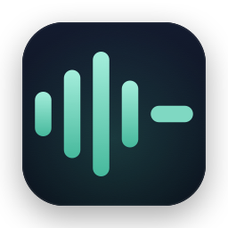
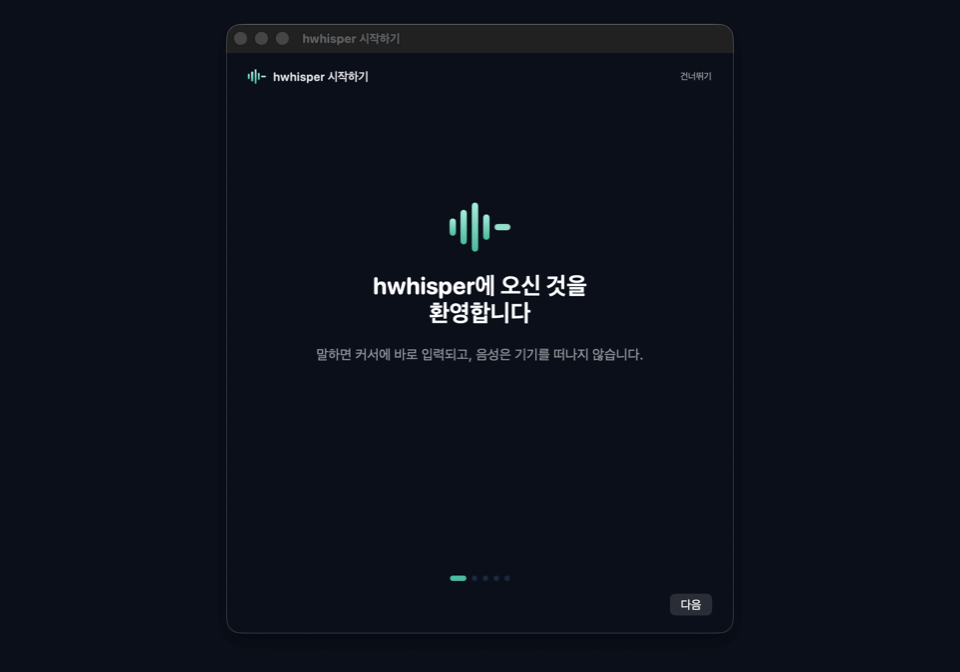

<p align="center">
  
</p>

<h1 align="center">hwhisper</h1>

<p align="center">
  <b>말하세요, 받아 적는 건 제가 합니다.</b><br>
  Wispr Flow·Typeless의 오픈소스·무료·프라이버시 대체재 · macOS 딕테이션 앱
</p>

<p align="center">
  <a href="https://github.com/hminnnnnn/hwhisper/releases/latest"></a>
  
  
  <a href="LICENSE"></a>
  
</p>

<p align="center">
  <a href="README.en.md">English</a> · 한국어(현재 문서)
</p>

<p align="center">
  
</p>

---

전역 단축키를 누르고 말하면, **음성이 기기를 떠나지 않고** 온디바이스에서 한/영 텍스트로 변환된 뒤, 선택적으로 LLM이 다듬어 **현재 커서 위치에 바로 입력**됩니다. Wispr Flow/Typeless가 음성을 클라우드로 보내는 것과 달리, hwhisper의 음성 인식은 전부 이 Mac 안에서 끝납니다.

## 주요 기능

- **온디바이스 받아쓰기** — Apple `SpeechTranscriber`(한국어 CER 1.9%)로 음성을 기기 안에서 텍스트로. 단일 키 토글(우측⌘/우측⌥/fn) 또는 조합키.
- **LLM 텍스트 정제** — 필러 제거·문장부호 교정·구조화. Gemini/Groq(무료 티어)·로컬 Ollama·커스텀 중 선택. 항상 선택 사항이며 실패 시 원문 삽입.
- **개인 사전** — 자주 틀리는 이름·용어를 등록하면 인식·정제·최종 치환 3단계에서 항상 올바른 표기로.
- **히스토리** — 받아쓴 내용(원본/정제본)을 이 Mac에만 저장·검색·복사. 언제든 전체 삭제 가능.
- **홈 대시보드** — 이번 주 받아쓰기 시간·단어 수·절약 시간·앱별 사용 빈도.
- **완전 무료·무제한** — 구독·단어 수 제한 없음. 정제용 무료 API 키만 있으면(또는 없어도) 동작.

## 요구 사항

- **Apple 음성 엔진(기본):** macOS 26(Tahoe) 이상 **+ Apple Silicon(M1 이상)**. Apple `SpeechTranscriber`는 Neural Engine에 의존하므로 Intel Mac에서는 이 엔진을 쓸 수 없습니다.
- **구형/Intel Mac:** WhisperKit 폴백 경로 지원 예정(모델 다운로드·메모리 사용량이 더 큼).
- **소스 빌드 시:** Xcode Command Line Tools (`xcode-select --install`) — 전체 Xcode는 필요 없습니다.

## 설치

### 방법 A — 배포된 `.dmg` (권장)

1. Releases에서 `hwhisper-x.y.z.dmg`를 내려받아 엽니다.
2. `Hwhisper.app`을 `Applications` 폴더로 드래그합니다.
3. **첫 실행 (중요):** 이 앱은 유료 Apple 개발자 인증서로 공증(notarize)되지 않은 개인/오픈소스 빌드입니다. 그래서 macOS Gatekeeper가 처음엔 실행을 막습니다. 다음 중 하나로 한 번만 허용하면 됩니다.
   - **터미널 한 줄 (가장 확실):**
     ```bash
     xattr -dr com.apple.quarantine /Applications/Hwhisper.app
     ```
   - **또는 시스템 설정:** 앱을 한 번 실행 시도 → 차단 알림 → **시스템 설정 > 개인정보 보호 및 보안** 하단의 "확인 없이 열기" 클릭. (macOS 15 Sequoia부터 예전의 Control-클릭 → 열기 우회는 막혔습니다.)

> 왜 이런 단계가 필요한가요? Gatekeeper 경고 없이 바로 열리게 하려면 유료 Apple Developer Program($99/년)으로 공증해야 합니다. 이 앱은 비상업·오픈소스 프로젝트라 그 대신 위의 1회성 허용으로 배포합니다. 신뢰가 걱정되면 아래 방법 B로 직접 빌드하세요 — 직접 빌드한 앱은 이 단계가 필요 없습니다.

### 방법 B — 소스에서 직접 빌드

터미널을 열 필요 없이 실행할 수 있는 `.app` 번들을 만들려면 저장소 루트에서 다음을 실행합니다.

```bash
bash scripts/make-app.sh
```

스크립트는 `swift build -c release`로 릴리스 바이너리를 빌드한 뒤 `dist/Hwhisper.app`을 구성하고 코드사이닝까지 처리합니다. 직접 빌드한 앱은 격리(quarantine) 속성이 붙지 않아 위의 첫 실행 허용 단계가 필요 없습니다. 완료되면 다음 중 하나로 실행할 수 있습니다.

```bash
open dist/Hwhisper.app          # 바로 실행
cp -R dist/Hwhisper.app /Applications/   # 또는 설치 후 Launchpad/Spotlight에서 실행
```

`.dmg`를 직접 만들려면 `bash scripts/make-dmg.sh`를 실행하세요(`dist/hwhisper-<버전>.dmg` 생성).

## 단계별 설치 가이드 (AI 도우미용 · 그대로 따라 안내 가능)

> 이 섹션은 사람이 그대로 따라 하거나, AI 도우미(Claude 등)가 사용자에게 한 단계씩 안내하도록 작성되었습니다. 각 단계는 **판단 조건 → 실행 명령 → 확인 방법** 순서입니다. 명령의 출력을 사용자에게 물어 다음 단계를 결정하세요.

### 0단계 — 환경 확인 (설치 경로가 갈립니다)

사용자 터미널에서 다음을 실행하고 출력을 확인합니다.

```bash
sw_vers -productVersion   # macOS 버전 (예: 26.0, 15.6, 14.7)
uname -m                  # arm64 = Apple Silicon, x86_64 = Intel
```

- **macOS 26 이상 + `arm64`** → Apple 온디바이스 엔진(빠름·고정확). 최적 경로.
- **macOS 14~15 (또는 `x86_64` Intel)** → 실행은 되지만 WhisperKit 폴백 사용. **최초 1회 모델 다운로드(~600MB)** 와 **첫 받아쓰기 수 분 소요**를 미리 안내하세요.
- **macOS 14 미만** → 미지원. 업데이트 안내.

### 1단계 — 앱 받기 (둘 중 하나)

**(A) 배포된 .dmg 사용** — 대부분의 사용자:

```bash
# 다운로드 폴더의 dmg를 마운트하고 앱을 /Applications로 복사 (버전은 실제 파일명에 맞추기)
hdiutil attach ~/Downloads/hwhisper-0.2.0.dmg
cp -R "/Volumes/hwhisper 0.2.0/Hwhisper.app" /Applications/
hdiutil detach "/Volumes/hwhisper 0.2.0"
```

**(B) 소스 빌드** — 개발자이거나 신뢰를 직접 확인하려는 사용자. 먼저 `xcode-select --install`(CLT)이 되어 있어야 합니다.

```bash
git clone <저장소 URL> hwhisper && cd hwhisper
bash scripts/make-app.sh
cp -R dist/Hwhisper.app /Applications/
```

> (B)로 빌드한 앱은 격리 속성이 없어 **2단계를 건너뜁니다.**

### 2단계 — 첫 실행 차단 해제 (dmg 설치 시에만)

이 앱은 공증되지 않아 Gatekeeper가 처음 실행을 막습니다. **한 번만** 아래를 실행하면 됩니다.

```bash
xattr -dr com.apple.quarantine /Applications/Hwhisper.app
```

확인: 위 명령이 오류 없이 끝나면 성공입니다. (터미널을 못 쓰는 사용자는 앱 실행 시도 → **시스템 설정 > 개인정보 보호 및 보안** 하단의 "확인 없이 열기" 클릭. macOS 15+에서는 Control-클릭 우회가 막혀 이 경로가 유일합니다.)

### 3단계 — 앱 실행

```bash
open /Applications/Hwhisper.app
```

확인: 화면 우상단 **메뉴 막대에 파형(🎙) 아이콘**이 나타나면 실행 성공입니다. Dock에는 아이콘이 없습니다(메뉴 막대 전용 앱). 안 보이면 5단계 문제 해결 참고.

### 4단계 — 권한 부여 + 온보딩

첫 실행 시 온보딩 창이 뜹니다. 안내에 따라 두 권한을 허용하세요. 직접 여는 경로:

- **마이크:** 시스템 설정 > 개인정보 보호 및 보안 > 마이크 → `Hwhisper` 켜기
- **손쉬운 사용(텍스트 삽입/전역 단축키):** 시스템 설정 > 개인정보 보호 및 보안 > 손쉬운 사용 → `Hwhisper` 켜기

권한 상태는 다음으로 프로그램적으로 확인할 수 있습니다(둘 다 있어야 정상 동작):

```bash
# 마이크: "Hwhisper" 항목이 보이면 등록된 것
sqlite3 "$HOME/Library/Application Support/com.apple.TCC/TCC.db" \
  "SELECT service,auth_value FROM access WHERE client LIKE '%hwhisper%';" 2>/dev/null || \
  echo "TCC.db 직접 조회 불가 — 시스템 설정 UI로 확인하세요"
```

권한을 켠 뒤에는 앱을 완전히 종료(메뉴 막대 아이콘 > Quit hwhisper)했다가 다시 실행하면 확실히 반영됩니다.

### 5단계 — 동작 확인

1. 아무 텍스트 입력창(메모, TextEdit 등)에 커서를 둡니다.
2. **우측 ⌘ 키를 짧게 한 번 탭** → 화면 하단에 "듣는 중…" 표시가 뜹니다.
3. 한 문장 말한 뒤 **다시 우측 ⌘ 탭** → 잠시 후 커서 위치에 텍스트가 삽입됩니다.
4. WhisperKit 경로(구형 Mac)라면 첫 회는 "음성 모델 준비 중…"이 뜨고 수 분 걸립니다 — 정상입니다.

로그로 진단(모든 단계가 기록됩니다):

```bash
tail -20 ~/Library/Logs/Hwhisper.log
```

`recording started` → `transcribed N chars` → `insertion outcome: inserted` 순으로 찍히면 정상입니다.

### 문제 해결

| 증상 | 원인·조치 |
|---|---|
| 실행해도 메뉴 막대에 아이콘이 없음 | 대부분 정상(Dock 아이콘 없음). 우측⌘ 탭이 반응하는지부터 확인. 여전히 없으면 `~/Library/Logs/Hwhisper.log` 확인 |
| "손상되어 열 수 없음" 경고 | 2단계 `xattr` 미실행. 위 명령 실행 |
| 우측⌘ 탭 무반응 | 손쉬운 사용/입력 모니터링 권한 미부여. 4단계 재확인 후 앱 재시작. 단축키를 우측⌥/fn/조합키로 바꿔볼 수도 있음(메뉴 > 설정) |
| 받아쓰기는 되는데 삽입이 안 됨 | 손쉬운 사용 권한 문제. 삽입 실패 시 텍스트는 클립보드에 보존되므로 ⌘V로 붙여넣기 가능 |
| 정제가 안 됨 | 정제는 선택 사항. 설정에서 켜고 무료 API 키 입력(아래 "텍스트 정제 설정"). 안 켜도 원문은 삽입됨 |

## 첫 실행 시 권한 부여

hwhisper는 마이크 입력과 다른 앱에 텍스트를 입력하기 위한 손쉬운 사용(Accessibility) 권한이 필요합니다. 처음 실행하면 macOS가 권한 요청 다이얼로그를 띄우거나, 앱이 조용히 동작하지 않을 수 있습니다. 아래 경로에서 직접 권한을 확인/부여하세요.

- **마이크:** 시스템 설정 > 개인정보 보호 및 보안 > 마이크 → `Hwhisper` 체크
- **손쉬운 사용(텍스트 삽입/전역 단축키):** 시스템 설정 > 개인정보 보호 및 보안 > 손쉬운 사용 → `Hwhisper` 체크

권한을 켠 뒤에는 앱을 완전히 종료했다가(메뉴바 아이콘 > Quit hwhisper) 다시 실행해야 반영되는 경우가 있습니다.

## 단축키 지정

기본 단축키는 최초 실행 시 자동으로 시딩됩니다(다시 실행해도 사용자가 바꾼 값은 덮어쓰지 않습니다). 원하는 조합(예: `⌘⇧Space`)으로 바꾸려면:

1. 메뉴바의 🎙 아이콘 클릭
2. **설정…** 클릭 (또는 메뉴바 메뉴가 열려 있을 때 `⌘,`)
3. 단축키 녹화 필드를 클릭하고 원하는 키 조합을 누름

단축키는 **토글 방식**입니다: 한 번 누르면 녹음이 시작되고, 다시 누르면 녹음이 끝나며 바로 받아쓰기와 텍스트 삽입이 진행됩니다. 누르고 있을 필요는 없습니다. 녹음 중에는 화면 하단 중앙에 작은 표시창이 떠서 듣고 있음을 보여주고(실시간 음량 미터 포함), 변환 중/완료/실패 상태도 같은 위치에 표시됩니다.

## 텍스트 정제(Refinement) 설정

원문 받아쓰기(raw)에 더해, LLM으로 필러 워드 제거·문장부호/띄어쓰기 교정·자연스러운 문장 다듬기를 거친 "정제된" 텍스트를 삽입할 수 있습니다. **정제는 항상 선택 사항이며, 실패하거나 시간 초과되면 자동으로 원문이 삽입됩니다** — 정제 때문에 받아쓰기 자체가 막히는 일은 없습니다.

메뉴바 🎙 아이콘 > **설정…** (`⌘,`) > **텍스트 정제** 섹션에서 설정합니다.

1. **정제 사용** 토글을 켭니다.
2. **정제 강도**를 고릅니다 — **다듬기**(필러 제거, 문장부호/띄어쓰기 교정만) 또는 **구조화**(다듬기에 더해 나열형 내용은 번호 목록으로, 서로 다른 주제는 단락으로 재구성).
3. **프로바이더**를 고릅니다. 하나의 OpenAI 호환 chat-completions 클라이언트로 아래 네 가지를 모두 지원합니다.
   - **Gemini** — 무료 API 키 발급: https://aistudio.google.com/apikey (기본 모델: `gemini-3.1-flash-lite`)
   - **Groq** — 무료 API 키 발급: https://console.groq.com/keys (기본 모델: `llama-3.3-70b-versatile`)
   - **Ollama (로컬)** — API 키 불필요, 완전히 오프라인으로 동작 (기본 모델: `qwen2.5:3b`). 아래 "Ollama 로컬 사용법" 참고.
   - **커스텀** — 임의의 OpenAI 호환 `/chat/completions` 엔드포인트 URL을 직접 입력.
4. 필요하면 **모델명**을 프리셋 기본값에서 바꿀 수 있습니다.
5. Gemini/Groq/커스텀은 **API 키**를 입력합니다. **API 키는 UserDefaults가 아니라 `~/Library/Application Support/Hwhisper/credentials.json`에 저장됩니다** (프로바이더별로 별도 저장 — 프로바이더를 바꿔도 이전에 저장한 키가 지워지지 않습니다). 이 파일과 그 상위 폴더는 현재 macOS 사용자 계정만 읽을 수 있도록 소유자 전용 권한(파일 `0600`, 폴더 `0700`)으로 생성되며, 디스크 자체는 FileVault로 암호화됩니다 — `gh`/`aws`/`gcloud` 같은 CLI 도구들이 자격 증명을 저장하는 방식과 동일합니다. (이전 버전은 macOS 키체인을 사용했지만, 자체 서명된 개발 인증서로는 "항상 허용"을 눌러도 접근 승인 프롬프트가 계속 다시 떠서 — securityd가 자체 서명 신원의 ACL을 안정적으로 검증하지 못함 — 프롬프트 없는 파일 저장 방식으로 옮겼습니다. 최초 실행 시 기존 키체인 항목이 있으면 자동으로 마이그레이션됩니다.) Ollama는 키가 필요 없습니다.
6. **타임아웃(초)**을 설정합니다(기본 8초). 이 시간 안에 정제가 끝나지 않으면 원문이 대신 삽입됩니다.

**프라이버시:** 정제를 켜면 받아쓰기 원문에서 다듬어진 **텍스트만** 선택한 프로바이더로 전송됩니다(커스텀 프로바이더는 `https://` 또는 로컬 `localhost`만 허용 — 평문 전송 방지). **음성(오디오)은 어떤 경우에도 외부로 전송되지 않습니다** — 음성 인식은 항상 기기 안에서 끝납니다. 참고로 텍스트 삽입은 기본적으로 클립보드+⌘V 방식을 쓰므로, 삽입되는 짧은 순간 전사 텍스트가 시스템 클립보드를 거칩니다(보안 입력 필드에서는 클립보드에 쓰지 않습니다).

### Ollama로 완전히 로컬에서 정제하기

API 키 없이, 네트워크 없이 정제하고 싶다면 Ollama를 로컬에 설치해 사용하세요.

```bash
brew install ollama
ollama serve &          # 이미 실행 중이면 생략 (curl http://localhost:11434 로 확인 가능)
ollama pull qwen2.5:3b   # 한국어 정제에 필요한 최소 크기 모델(약 2.2GB)
```

이후 설정에서 프로바이더를 **Ollama (로컬)** 로 선택하면 바로 사용할 수 있습니다. 참고: 8GB 메모리 기기에서는 qwen2.5:3b를 상주시키는 데 약 2.2GB가 들어 스왑 압박이 커질 수 있습니다 — 메모리가 빠듯하면 Gemini/Groq 같은 무료 클라우드 프로바이더를 우선 사용하는 것을 권장합니다.

## 인식 언어 설정

설정 > **인식 언어**에서 한국어(기본)/영어/자동 중 고를 수 있습니다. 영어로 말했는데 계속 한국어로 잘못 인식된다면 **영어**로 바꿔 보세요. **자동**은 현재 한국어를 우선 인식합니다 — 한 문장 안에서 한/영이 완전히 자동으로 전환·감지되는 기능은 아직 지원되지 않습니다.

## 로그 확인

앱 실행 로그는 `~/Library/Logs/Hwhisper.log`에 계속 누적됩니다(`open`으로 실행해도 남습니다). 단축키가 반응하지 않거나 받아쓰기가 실패하는 경우 이 파일을 확인하면 원인(권한 미부여, 오디오 엔진 오류, 인식 엔진 오류 등)을 진단할 수 있습니다.

```bash
tail -f ~/Library/Logs/Hwhisper.log
```

## 로그인 시 자동 실행

macOS 자체 로그인 항목 기능을 사용합니다.

1. `Hwhisper.app`을 `/Applications`로 복사
2. 시스템 설정 > 일반 > 로그인 항목 > "열기 항목" 에 `+`로 `Hwhisper` 추가

## 안정적인 코드 서명 (권한 리셋 방지)

기본값인 ad-hoc 서명은 재빌드할 때마다 서명 식별자가 바뀌어, macOS가 이미 부여된 마이크/손쉬운 사용 권한을 다시 요청하는 원인이 됩니다. 이를 막으려면 재빌드 사이에도 동일하게 유지되는 자체 서명 인증서("hwhisper-dev")를 한 번만 만들어두면 됩니다.

1. 인증서 생성 + 로그인 키체인 임포트:

   ```bash
   bash scripts/make-signing-cert.sh
   ```

2. **수동 단계 (자동화 불가 — macOS가 UI 확인을 요구합니다):** Keychain Access(키체인 접근)를 열어 신뢰 설정을 해야 인증서가 실제로 코드 서명에 쓰입니다.
   1. Spotlight에서 "Keychain Access" 검색 후 실행
   2. 왼쪽에서 **login** 키체인 선택 → **내 인증서(My Certificates)** 카테고리 선택
   3. `hwhisper-dev` 항목을 더블클릭
   4. **신뢰(Trust)** 를 펼치고 **코드 서명(Code Signing)** 을 **항상 신뢰(Always Trust)** 로 변경
   5. 패널을 닫고 (요구되면) macOS 계정 암호 입력
3. 다시 빌드:

   ```bash
   bash scripts/make-app.sh
   ```

   `hwhisper-dev` 인증서가 감지되면 자동으로 그 인증서로 서명합니다(콘솔에 "Signing with stable identity: hwhisper-dev" 출력). 인증서가 없거나 신뢰 설정이 안 되어 있으면 기존과 같이 ad-hoc 서명으로 폴백하고 안내 메시지를 출력합니다.

이 절차를 한 번 거치고 나면 이후 재빌드에서는 권한을 다시 요청하지 않습니다.

## 알려진 제약

- **ad-hoc 서명(기본값, 인증서 미생성 시):** `scripts/make-app.sh`는 위 `hwhisper-dev` 인증서가 없으면 개발자 인증서 없이 ad-hoc(`codesign --sign -`)으로 서명합니다. 재빌드할 때마다 앱의 서명 식별자가 바뀌므로, macOS가 마이크/손쉬운 사용 권한을 다시 요청할 수 있습니다. 재빌드 후 권한 다이얼로그가 다시 뜨거나 삽입이 동작하지 않으면 위 "안정적인 코드 서명" 절차를 진행하거나, 권한 설정을 다시 확인하세요.
- **음성 인식 엔진:** macOS 26+ (Apple Silicon)에서는 Apple `SpeechTranscriber`(온디바이스)를 기본으로 사용합니다. macOS 26 미만에서는 WhisperKit 폴백으로 자동 전환됩니다 — **최초 1회 모델 다운로드(~600MB)**가 필요하고 메모리 사용량이 더 크며, **실행 후 첫 받아쓰기는 모델 로드+최초 CoreML 컴파일 때문에 수 분 걸릴 수 있습니다**(그 이후 같은 실행에서는 빠릅니다). 이 동안 화면에는 "음성 모델 준비 중…" 표시가 뜹니다.
- **네트워크:** 기본 경로(원문 받아쓰기)는 최초 자산 준비 이후 완전히 오프라인으로 동작합니다. 정제(refinement) 기능을 켜면 사용하는 경로(클라우드 BYOK vs 로컬 LLM)에 따라 네트워크 사용 여부가 달라집니다.

## 배포 (개발자용)

이 앱을 직접 배포하려면 `docs/RELEASING.md`를 참고하세요 — 무료 트랙(self-signed dmg, 지금 가능)과 공증 트랙(D1: Apple Developer ID 서명 → 공증 → 스테이플 → Sparkle 자동 업데이트)의 구체 절차를 담고 있습니다.

## 라이선스

[MIT](LICENSE) — Copyright (c) 2026 hminn
